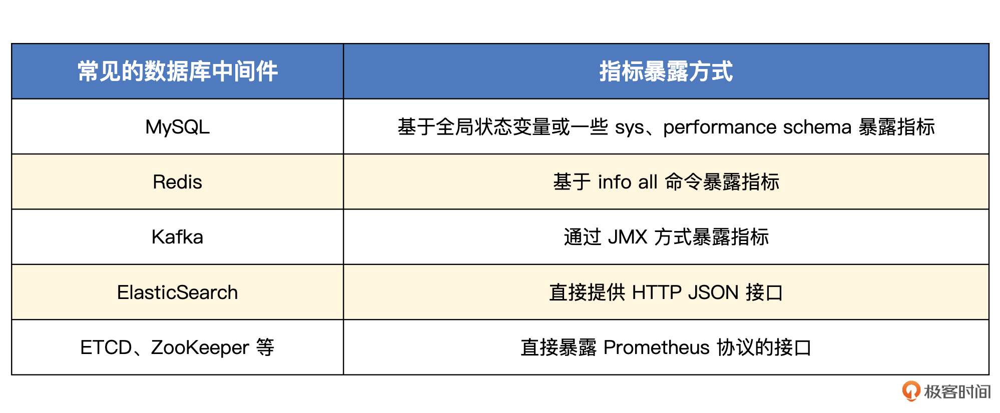

# 开篇词｜每个关注高可用的人，都应该了解监控知识
你好，我是秦晓辉。欢迎你跟我一起学习运维监控系统。

参加工作的十余年间，我一直在运维圈子里摸索，先后就职于百度、小米、金山云、滴滴，做过运维平台的开发、一线运维，也做过运维团队的管理。目前是快猫星云的联合创始人，做的也是监控与稳定性保障相关的产品。

同时我也是监控相关的开源项目 [Open-Falcon](https://github.com/open-falcon)、 [Nightingale](https://github.com/ccfos/nightingale)、 [Categraf](https://github.com/flashcatcloud/categraf) 的核心开发者，你可以试着从社区里找一找我的身影（ID：UlricQin），相信这不是一件难事。

Open-Falcon 是 14 年开源的，当时我在小米，和来炜（快猫星云 CEO）一起开发了第一个版本，因为需求梳理阶段有多名资深运维人员参与，所以上线之后很快就大面积铺开了，成功替换掉了小米内部的 3 套 Zabbix和业务监控系统 perfcounter，成为小米内部统一的监控系统。14年开源后，广受业界关注，美团、360、新浪微博、京东、爱奇艺、SEA、方正证券、金山云等很多公司都在内部成功落地。

回头来看，Open-Falcon 14 年踩了一个很好的时间点，一定程度上解决了那个时代的监控问题，所以得到了很多公司的认可。但是随着云原生架构的流行，Open-Falcon 没有做出适应性的调整，错失了这一波云原生的机会。

而此时Prometheus 生态随着 Kubernetes 的流行，已成为云原生监控事实上的标准。我们在 2020 年开源了 Nightingale，也就是夜莺。夜莺的 5.0 版本也完全拥抱了 Prometheus 生态，尝试对 Prometheus 做一些增强，希望在云原生监控这个赛道再度发力。夜莺如今托管在中国计算机学会开源发展委员会，比 Open-Falcon 有更好的社区治理架构，未来可期。

Categraf 则是一款监控数据采集器，是类似 Telegraf、Datadog-agent、Grafana-agent 的一个 Agent，可以采集 metrics、logs、traces，尝试做一个大一统的采集解决方案，同时希望在项目里沉淀出各个监控目标的最佳实践，做到开箱即用。

这 8 年来的社区维护工作，让我接触到了形形色色的人，也回答了海量的监控问题。

比如：

- 指标有哪些类型，哪类指标比较关键？
- 如何部署一套高可用的监控系统，存储应该如何选型？
- 如何监控 MySQL、Redis、Kafka、ElasticSearch?
- 如何监控 Kubernetes 这么复杂的平台?
- 如何埋点，如何分析日志？
- 如何做到事件闭环和告警自愈？
- ……

这些问题让我深深地意识到运维监控领域，缺少一套体系化的课程，把监控这个事情深入浅出地讲透。虽然网上可以搜索到很多碎片化的知识，但是都不成体系，很多甚至还有错误，所以我萌生了写这个课程的想法，希望呈现给你 **一套正确的、系统的、尽可能完备的运维监控系统知识手册。** 希望你不用再为了寻找一个答案而苦苦搜索，也不必再自己去一块一块地拼凑知识。这些问题我都会在课程中悉数为你解答。

提问的这些人当中，大部分是运维工程师、业务研发，还有监控和稳定性系统建设人员，对他们来说运维监控相关的知识是工作中必不可少的一部分。那是不是其他领域的人就没必要了解监控相关的知识了呢？不是的。

## 哪些人应该学习监控相关的知识？

应该说，每个关注高可用、关注服务稳定性的技术人员都应该学习监控相关的知识。在稳定性保障体系中，核心就是在干一件事，减少故障。我们可以看一下故障的生命周期。

减少故障有两个层面的意思，一个是做好常态预防，不让故障发生；另一个是如果故障发生，要能尽快止损，减少故障时长。而监控的典型作用，就是帮助我们 **发现及定位故障**，这两个环节对于减少故障时长至关重要。

运维人员和研发人员是典型的关注稳定性的人，不过侧重点不同。一般来说，运维人员负责全公司所有业务的运维工作，研发人员只负责自己业务线的研发工作，所以发生故障的时候，运维人员更希望快速找到问题根因，及时止损。而研发人员，更希望能“自证清白”。不管出于何种目的，监控都是不可或缺的工具。

当然，监控的作用还有很多，比如用于日常巡检，作为性能调优的数据佐证，提前发现一些设备、中间件不合理的配置。之所以能做到这些，是因为所有优秀的软件，都内置了监控数据的暴露方法，让用户可以对其进行观测，了解其健康状况。 **可被监控和观测，也是我们开发软件时必须考虑的一环。**

## 监控是做好软件架构的重要一环

好的软件架构，一定是考虑了高可用的，一定是考虑了各类故障的发现和应对手段的。一名合格的架构师，理应对各种监控手段都熟稔于心。

比如各类开源组件，有的是直接暴露了 Prometheus metrics 接口，有的是暴露了 HTTP JSON接口，有的是通过 JMX 暴露监控数据，有的则需要连上去执行命令，虽然大家的指标暴露方式不一样，但没有哪个是缺少监控能力的。

业务程序也有多种暴露方式，比较知名的埋点工具是 StatsD、Prometheus。当然，有些语言会有适合自己的更易用的埋点工具，比如 Java 生态的 Micrometer。业务程序除了指标埋点监控，通常还有更丰富的观测手段，比如引入链路追踪的框架：Zipkin、Jaeger、Skywalking 等。当然了，所有软件都可以使用日志的方式来暴露健康状况，不过这种方式最昂贵，数据非结构化，适合排查问题，但不适合作为指标数据的来源。

所以，如果你要认识哪个自称架构师的人，在设计架构的时候压根不考虑监控方式，你可以在心中狠狠地鄙视他一下！

对面的你也是一样， **想要在技术这条路上走得更远，监控相关的知识必不可少**。如果你现在还不具备这样的能力，也完全不用担心，这一段路我会带着你一起前行。

## 我是如何设计这门课的？

为了你能够快速入门，循序渐进地学习，我把本课程分成了4个部分。

**第一部分：基础知识**

学习监控知识，得先了解为什么，也就是监控是因何产生的，解决了什么问题，有哪些典型的方案，分别有什么优缺点。然后了解这个领域的一些基本术语行话，免得听不懂别人在说什么。最后我会给你总结通用的监控系统架构，提前打好铺垫，为后面的学习奠定理论基础。

**第二部分：搭建并优化 Prometheus**

了解了基础知识之后，就需要动手实践一下了。第二部分我就带你一起搭建 Prometheus 这个监控系统，让你对监控系统有一个感性的认识。为什么选择 Prometheus 而不是其他监控系统，最核心的原因是 Prometheus 在当下云原生的环境下真的太流行了，其次是 Prometheus 搭建简单、使用灵活、体现了很多设计哲学，有助于你理解监控系统的相关设计。

此外，这个部分我会带你一起剖析 Prometheus 的一些关键设计，就是这些关键设计奠定了它的江湖地位。但是 Prometheus 也不是尽善尽美的，真正在生产环境下使用，还需要解决存储扩展问题，规则管理的协同问题，对此社区有一些解决方案，我会带你一起比较选型。

**第三部分：监控实战，搞定常见的监控需求**

操作系统、网络设备、MySQL、Redis、Kafka、ElasticSearch、Kubernetes、应用、日志等等，所有常见监控的需求统统搞定，我会讲解各个监控目标是如何采集监控数据的，哪些指标最关键。中间穿插一些问题排查手段，并提供配置好的仪表盘，让你开箱即用的同时，知其然并知其所以然。

这一部分的内容你可以有侧重地学习，比如你是DBA就可以多花一些时间，重点了解操作系统、MySQL、Redis相关的知识。不过我还是建议你全部跟下来，了解不同中间件的监控实战方式，对你构建体系化的认知、拓宽视野很有帮助。

**第四部分：告警实战，设计良好的告警系统应该具备哪些能力**

监控数据采集上来之后，下一步就是要甄别异常数据并发出告警了。这个部分包括告警规则、屏蔽规则、抑制规则、订阅规则的管理，还有告警事件的管理以及告警事件触发后的自愈逻辑。一般监控系统都支持配置告警规则，可以产生告警事件，但是针对告警事件后续的支持偏弱，没有很好的聚合收敛、事件闭环的能力。不过我会给你介绍相关的设计逻辑和考量点，帮助你选型这方面的商业产品。当然，如果你后续选择自研，这些思考也会大有裨益。

这就是我们这个课程的核心内容，作为一个多年的监控系统研发人员，我力争用深入浅出的方式，带给你一些更专业的思考和原理性的讲解，传授给你一些实战落地的经验，把我十余年所学倾囊相授。学完这门课程，在监控领域，你的认知一定能超越九成的技术人员，为你的成长之路添一块垫脚石。下面就开始我们的监控之旅吧！